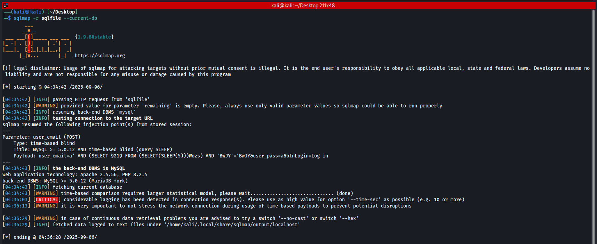
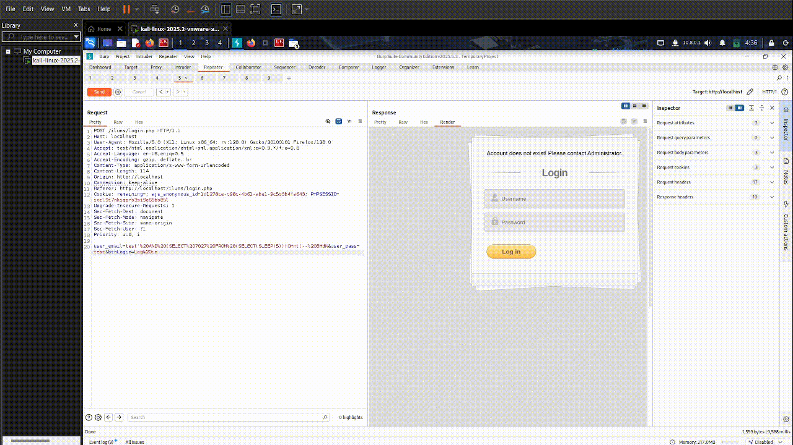
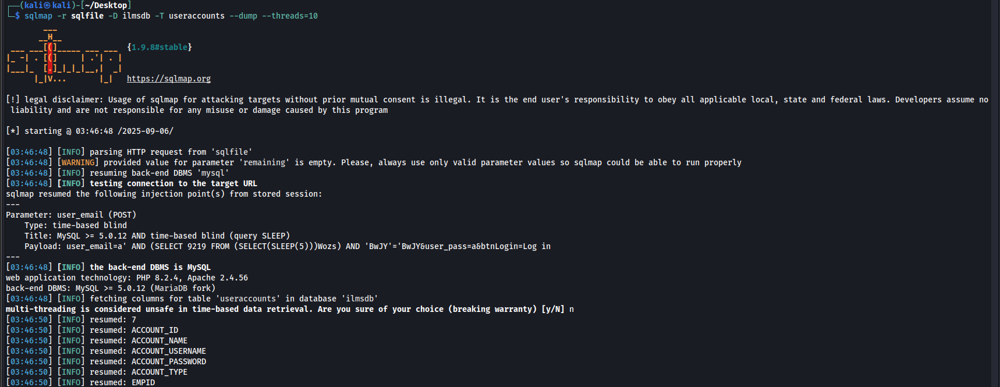

# Time-Based Blind SQL Injection in ``login.php``

|             | Details |
|-------------------|---------|
| **Vulnerability Type** | SQL Injection (Time-Based Blind) |
| **Affected File** | `login.php` → calls ``User::AuthenticateUser()`` in ``include/user.php`` |
| **Parameter** | `user_email` |
| **Vendor** | [itsourcecode](https://itsourcecode.com/) |
| **Product** | [Web-Based Internet Laboratory Management System v1](https://itsourcecode.com/free-projects/php-project/web-based-internet-laboratory-management-system-using-php/) |
| **Softlink** | https://itsourcecode.com/free-projects/php-project/web-based-internet-laboratory-management-system-using-php/ |


---

### Summary
-  A time-based blind SQL injection vulnerability exists in the login.php page of the ILUMS project. The ``user_email`` parameter is directly concatenated into an SQL query without sanitization or parameter binding.
-  This flaw allows attackers to perform time-based inference attacks to extract database content, including usernames and password hashes, ultimately leading to full compromise of authentication credentials.

**Evidence:** *sqlmap output*


### Vulnerable Code
```php
// include/user.php
$mydb->setQuery("SELECT * FROM `useraccounts` 
                 WHERE `ACCOUNT_USERNAME`='" . $email . "' 
                 and `ACCOUNT_PASSWORD`='" . $h_upass ."' LIMIT 1");

```
-  The ``$email`` variable (from ``user_email`` POST parameter) is directly embedded into the SQL query.
-  No prepared statements or escaping are used.
-  This allows attackers to inject crafted SQL payloads.

---

## Proof of Concept (PoC)
The following payload was generated and tested with sqlmap against the ``user_email`` parameter in ``login.php``.

### 1. Request in Burp
-    A normal login attempt was intercepted with Burp Suite.
-    The raw request was saved into a file sqlfile for sqlmap testing.
  


### 2. ``sqlmap`` dump
-   Run sqlmap using the Burp request file
-   sqlmap confirmed the injection point.
  


---

## Result:
-  The server delayed its response by 5 seconds, confirming successful time-based injection.
-  Sqlmap was able to enumerate the database ``(ilmsdb)`` and dump the useraccounts table.
